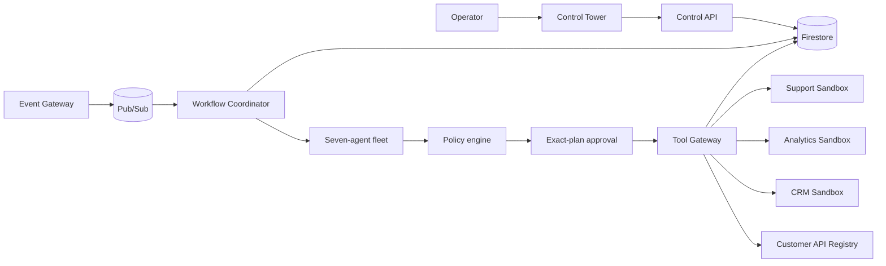

# Enterprise ChangeOps

Enterprise ChangeOps is a governed, event-driven platform for coordinating
high-risk changes across enterprise systems. It combines AI-assisted impact
analysis with deterministic policy enforcement, exact-plan human approval,
bounded tool execution, independent verification, rollback, and tamper-evident
audit evidence.

The included sandbox demonstrates a `customer_id` to `customer_uuid` migration
across a customer API registry, CRM, analytics, and support systems. It is built
for safe evaluation: every integration uses disclosed synthetic data and
production writes are disabled.

## Why it exists

Enterprise changes rarely stay inside one system. A schema migration can affect
APIs, operational databases, analytics pipelines, support workflows, and the
teams responsible for each of them. The difficult part is not generating a
change plan; it is proving that the plan is authorized, executing only what was
approved, recovering safely from partial failure, and leaving evidence that an
independent reviewer can trust.

Enterprise ChangeOps puts those controls around the full workflow.

## Core capabilities

- **Seven-agent analysis fleet** for discovery, dependency analysis, planning,
  risk, compliance, verification, and rollback recommendations
- **Deterministic control plane** that owns workflow state, authorization,
  retries, approvals, and tool execution rather than delegating them to a model
- **Exact-plan approval** using canonical cross-runtime plan hashes so execution
  cannot drift from the plan a human reviewed
- **Closed tool registry** with typed arguments, scoped identities, quotas,
  idempotency, and tenant-aware policy checks
- **Durable event workflows** with transactional ingestion, resumable execution,
  bounded retries, dead-letter handling, and rollback from hashed snapshots
- **Independent verification** across all affected systems before a change is
  considered complete
- **Operational Control Tower** for workflows, agent activity, approvals,
  security blocks, dead letters, and merged audit evidence
- **Managed governance adapters** for Model Armor, Agent Registry, Memory Bank,
  Secret Manager, Firestore, and Pub/Sub on Google Cloud

## Architecture



The AI layer proposes and evaluates work. Deterministic application code
controls every state transition and side effect. Untrusted change content is
screened before agent execution, historical memory remains tenant-scoped and
cited, and each tool call is checked against the approved plan.

## Change workflow

1. An authenticated change request enters a transactional inbox.
2. The agent fleet gathers evidence and produces a bounded remediation plan.
3. The policy engine evaluates identity, tenant, risk, tool, and approval rules.
4. A human approves the exact canonical plan hash.
5. The workflow coordinator executes the plan DAG through the Tool Gateway.
6. Each affected system is verified independently.
7. The workflow completes with merged audit evidence or restores hashed
   snapshots in reverse order when recovery is required.

## Technology

| Area | Stack |
| --- | --- |
| Control Tower | Next.js, React, TypeScript |
| APIs and workflows | Python, FastAPI, Pydantic |
| Agent orchestration | Google Agent Development Kit (ADK) |
| Data and messaging | Firestore, Pub/Sub |
| Managed runtime | Cloud Run, Artifact Registry, Cloud Build |
| Security and governance | Model Armor, Secret Manager, IAM, deterministic RBAC/ABAC |
| Quality | pytest, Vitest, Ruff, mypy, npm audit, pip-audit |

## Run locally

### Prerequisites

- Python 3.12
- [uv](https://docs.astral.sh/uv/)
- Node.js 22 and npm 11
- Docker Desktop

Google Cloud credentials are not required for local development. The Docker
Compose stack uses the official Firestore and Pub/Sub emulators.

### Docker Compose

Start the complete local application:

```powershell
docker compose up -d --build --wait
```

Open the Control Tower at [http://127.0.0.1:3000](http://127.0.0.1:3000).

Stop the stack without deleting its data:

```powershell
docker compose stop
```

Compose starts the Control Tower, Control API, Event Gateway, Workflow
Coordinator, Tool Gateway, agent fleet, four synthetic enterprise services,
and the local Firestore and Pub/Sub emulators.

### Development tasks

```powershell
python scripts/tasks.py setup
python scripts/tasks.py lint
python scripts/tasks.py test
python scripts/tasks.py audit
python scripts/tasks.py build
python scripts/tasks.py smoke
```

Run both primary development services until interrupted:

```powershell
python scripts/tasks.py dev
```

Copy `.env.example` to `.env.local` only when overriding defaults. Never commit
credentials, service-account keys, or production secrets.

## Application endpoints

| Component | Address |
| --- | --- |
| Control Tower | `http://127.0.0.1:3000` |
| Control Tower health | `http://127.0.0.1:3000/api/health` |
| Control API and docs | `http://127.0.0.1:8000`, `http://127.0.0.1:8000/docs` |
| Customer API Registry | `http://127.0.0.1:8100` |
| CRM sandbox | `http://127.0.0.1:8101` |
| Analytics sandbox | `http://127.0.0.1:8102` |
| Support sandbox | `http://127.0.0.1:8103` |
| Agent fleet and docs | `http://127.0.0.1:8200`, `http://127.0.0.1:8200/docs` |
| Tool Gateway and docs | `http://127.0.0.1:8300`, `http://127.0.0.1:8300/docs` |
| Event Gateway and docs | `http://127.0.0.1:8400`, `http://127.0.0.1:8400/docs` |
| Workflow Coordinator and docs | `http://127.0.0.1:8500`, `http://127.0.0.1:8500/docs` |

## Acceptance checks

With the relevant local services running, the repository provides focused
end-to-end gates:

```powershell
python scripts/tasks.py sandbox-check
python scripts/tasks.py persistence-check
python scripts/tasks.py agent-fleet-check
python scripts/tasks.py tool-gateway-check
python scripts/tasks.py workflow-check
python scripts/tasks.py control-tower-check
python scripts/tasks.py managed-governance-check
```

The checks cover the cross-system migration, restart-safe persistence, the
seven-agent analysis flow, approval-bound execution, retries, dead letters,
rollback, Control Tower evidence, security screening, registry visibility, and
tenant-scoped incident memory.

Two additional checks require a configured Google Cloud project and Application
Default Credentials:

```powershell
python scripts/tasks.py managed-cloud-check
python scripts/tasks.py managed-runtime-check
```

`managed-cloud-check` calls the configured governance resources and fails closed
when isolation, identity, or security requirements are not met.
`managed-runtime-check` verifies the private Cloud Run services and their
authenticated health endpoints.

## Private Google Cloud deployment

The managed deployment builds ten runtime images and deploys private Cloud Run
services with keyless service identities, Firestore, Pub/Sub, Secret Manager,
Artifact Registry, and Cloud Build.

```powershell
.\deploy\phase9-managed-runtime.ps1 `
  -Project enterprise-changeops `
  -Region us-central1 `
  -Tag <release-tag>
```

The deployment script retains its historical filename for compatibility. The
deployed services do not grant unauthenticated access. Reach the Control Tower
through an authenticated local proxy:

```powershell
gcloud run services proxy changeops-control-tower `
  --project enterprise-changeops `
  --region us-central1 `
  --port 3000
```

The current managed sandbox is intentionally scaled to zero when not in use.
Requests can create billable Cloud Run instances, and synthetic service state
can reset when a revision restarts. Durable workflow, idempotency, and audit
state remains in Firestore.

## Repository layout

```text
apps/control-tower/             Operational Next.js interface
services/control-api/           Tenant-facing control API
services/agent-fleet/           Seven bounded ADK agents
services/tool-gateway/          Approval and typed execution boundary
services/event-gateway/         Authenticated transactional event ingestion
services/workflow-coordinator/  Durable DAG, retry, verification, and rollback
tool-services/                  Governed tool adapters
enterprise-sandbox/             Four synthetic enterprise systems
packages/                       Contracts, policy, persistence, and observability
infrastructure/                 Google Cloud and deployment assets
evaluations/                    Agent datasets, scorers, and reports
tests/                          Contract, integration, security, load, and E2E tests
docs/                           Architecture decisions and technical documentation
```

## Security boundaries

- `PRODUCTION_WRITES_ENABLED=true` is rejected at configuration load time.
- Managed services require authentication; unauthenticated Cloud Run access is
  not granted.
- Mutation arguments are bound to the exact approved canonical plan.
- Logs recursively redact authorization values, tokens, credentials, secrets,
  email addresses, and common API-key fields.
- Managed governance configuration fails closed when required resources,
  identities, or tenant scope are missing.
- Historical memory is treated as untrusted input and must remain tenant-scoped
  and cited.
- The Control Tower always labels the environment as `SANDBOX`.

See [ADR 0002](docs/architecture/adr/0002-deterministic-control-plane.md)
for the permanent deterministic control boundary and
[ADR 0012](docs/architecture/adr/0012-private-managed-runtime.md) for the private
managed-runtime architecture.

## License

Released under the [MIT License](LICENSE).
